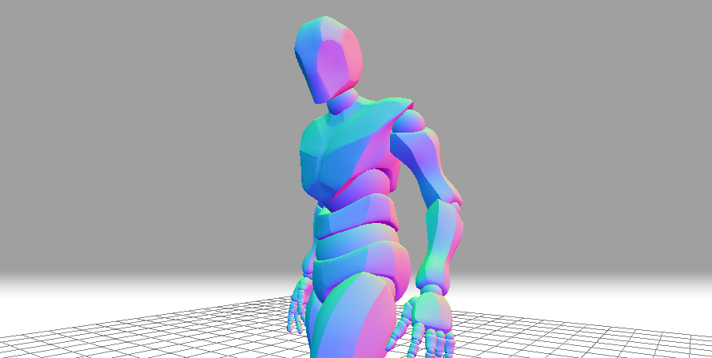

# isNotAJumper 🤸‍♀️



1st web game project @ Ironhack using three.js

Z/Q/S/D or Arrow Keys to move

Shift to Sprint

And SPACE To JUMP !

## Demo

https://isnotajumper-priveron.netlify.app/

## Installation

Start by cloning the repository !
Run locally with npm and webpack (webpack files imported from Simon Bruno ressources (I'm using webpack because of deployment issues))

```bash
  npm install
  npm run dev
```

To deploy this project run

```bash
  npm run build
  npm run deploy
```

- [@priveron](https://www.github.com/priveron)